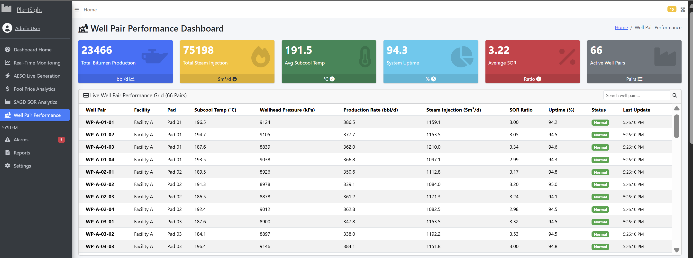
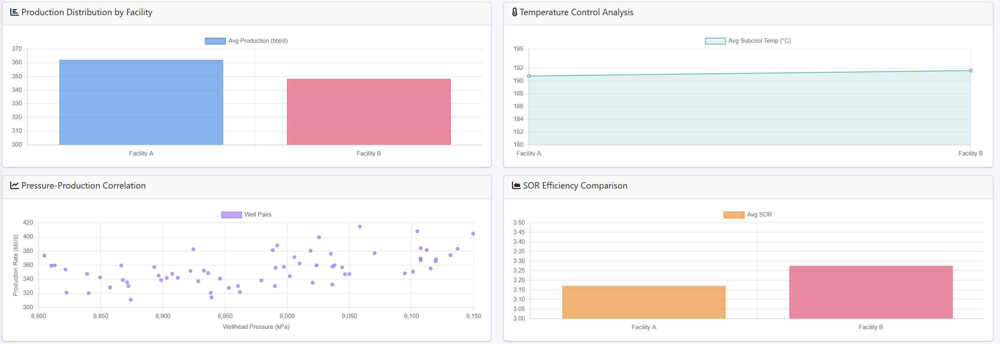
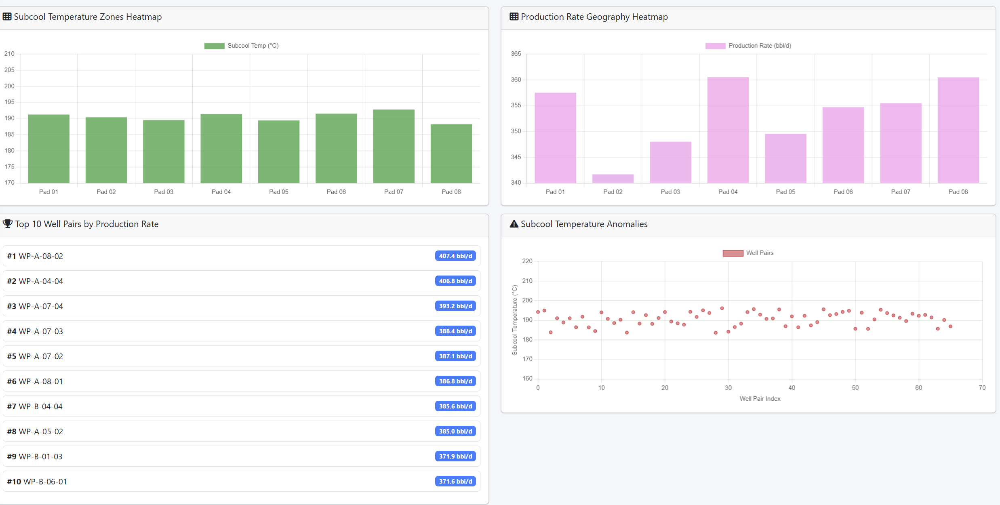
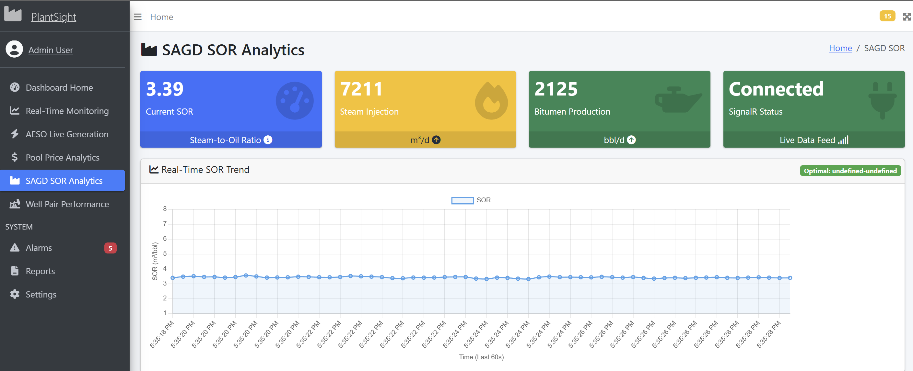
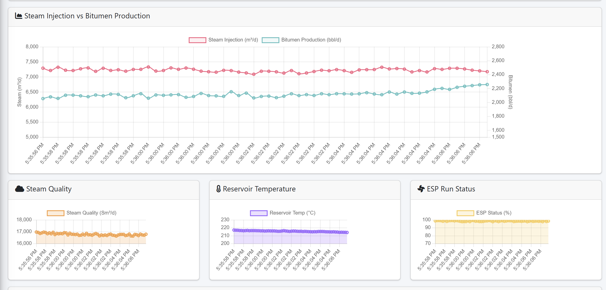

# PlantSightVizu

I wanted to further develop my understanding with .NET and C#, so I built this real-time SCADA dashboard to get hands-on experience with industrial monitoring systems and process control.

The core learning was around SAGD SOR real-time analytics. I focused on building a dashboard that calculates and visualizes Steam-to-Oil Ratio (SOR) on the fly using live process data.

## SOR Calculation

For calculating SOR, I used this formula:
```
SOR = Steam Injected (m³/d) ÷ Bitumen Produced (bbl/d)
```

To create the live simulation, I developed a Modbus simulator that generates realistic estimates:
- **Steam Injection Estimate**: Base value around 6,495 m³/d with sine wave variation (amplitude ~300) and random noise, bounded between 5,000-8,000 m³/d
- **Bitumen Production Estimate**: Base value around 2,150 bbl/d with inverse correlation to steam (phase-shifted sine wave) plus random trend and noise, bounded between 1,500-2,800 bbl/d

The simulator generates realistic time-series data using sine waves, random walk trends, and noise to simulate actual sensor readings from a SAGD well. This lets you test the entire system without needing real industrial hardware.

## Tech Stack

- ASP.NET Core 9.0
- SignalR for real-time updates
- Modbus TCP simulator (no real hardware needed)
- PostgreSQL/Supabase for data storage
- AdminLTE for the dashboard UI
- Chart.js for live charts

## Getting Started

You'll need .NET 9.0 SDK:

```bash
dotnet restore
cd src/Dashboard.Web
dotnet run
```

Then open `http://localhost:8080` in your browser.

## Screenshots

### Well Pair Performance Dashboard

The main dashboard provides real-time monitoring of all 66 well pairs with live KPIs and performance analytics.



**Live Well Pair Performance Grid** - Real-time status for all well pairs including subcool temperature, wellhead pressure, production rates, and SOR ratios.



**Performance Analytics** - Four analytical views showing production distribution, temperature control, pressure-production correlation, and SOR efficiency comparison across facilities.



**Heatmaps & Anomaly Detection** - Pad-level performance heatmaps and top 10 well pairs ranked by production rate. Anomaly detection identifies wells operating outside optimal parameters.

### SAGD SOR Analytics Dashboard

Real-time Steam-to-Oil Ratio analytics dashboard for monitoring SAGD operations and process efficiency.



**Real-Time SOR Monitoring** - Live calculation and visualization of Steam-to-Oil Ratio with operational status indicators and trend analysis.



**Performance Metrics & Trends** - Detailed analytics showing SOR efficiency, production rates, and operational parameters over time.

.png)

**Process Control Dashboard** - Comprehensive view of SAGD operations including steam injection rates, bitumen production, and system health metrics.

## Project Structure

- `src/Dashboard.Web` - Main web application
- `src/Dashboard.Domain` - Business logic and AESO API integration
- `src/Dashboard.Simulator` - Modbus TCP simulator that generates SAGD process data
- `src/Dashboard.Acquisition` - Data acquisition service
- `src/Dashboard.Persistence` - Database layer

## Configuration

Copy `appsettings.example.json` to `appsettings.json` and add your database connection string and AESO API key if you want live power grid data.

## Well Pair Performance Dashboard - Calculations & Assumptions

When building the real-time well pair performance dashboard, I made several assumptions and calculations to simulate realistic SAGD operations. Here's what I used:

### Well Pair Distribution

I set up 66 well pairs across 2 facilities:
- **Facility A**: 31 well pairs across 8 pads
- **Facility B**: 35 well pairs across 8 pads
- Each facility has 16 pads total (8 per facility), with well pairs distributed evenly across pads

### Production Rate Simulation

For bitumen production rates, I used different base values per facility:
- **Facility A**: Base production of 383.4 bbl/d per well pair
- **Facility B**: Base production of 360.8 bbl/d per well pair

Each well pair's production rate is calculated every second using:
- A sine wave function (frequency 0.5, amplitude ±30 bbl/d) to simulate cyclical variations
- A random walk trend that slowly drifts up or down (bounded between -30 to +30 bbl/d)
- Random noise (±20 bbl/d) to add realistic sensor variance
- Final values are clamped between 250-500 bbl/d to stay within operational limits

### Subcool Temperature Modeling

Subcool temperature is critical for SAGD operations, so I modeled it carefully:
- Base temperature: 187.0°C (within the optimal 175-205°C range)
- Sine wave variation (frequency 0.3, amplitude ±8°C) for natural temperature cycles
- Random noise (±3°C) for sensor precision variance
- Values bounded between 175-205°C to represent normal operating conditions

The optimal operating zone is set at 175-205°C, which I used for color-coding in the heatmaps and anomaly detection charts.

### Wellhead Pressure Simulation

Wellhead pressure varies based on steam injection and reservoir response:
- Base pressure: 9,000 kPa
- Sine wave fluctuation (frequency 0.4, amplitude ±150 kPa) representing pressure waves
- Random noise (±100 kPa) for measurement variance
- Facility-specific control ranges: Facility A maintains tighter control (±150 kPa), Facility B allows slightly more variation (±200 kPa)
- Values clamped between 8,000-10,500 kPa for safety limits

### Steam Injection Rates

Steam injection is simulated to match typical SAGD operations:
- Base injection: 1,180 Sm³/d per well pair
- Sine wave variation (frequency 0.6, amplitude ±80 Sm³/d) for injection cycles
- Random noise (±50 Sm³/d) for operational adjustments
- Bounded between 1,000-1,400 Sm³/d to represent typical operational ranges

### SOR Ratio Calculation

The Steam-to-Oil Ratio is calculated in real-time:
```
SOR = Steam Injection (Sm³/d) ÷ Production Rate (bbl/d)
```

When production rate is zero or very low, I default to facility-specific values:
- Facility A default SOR: 3.20
- Facility B default SOR: 3.19

This ensures the dashboard always shows meaningful SOR values even during production interruptions.

### System Uptime Tracking

Uptime percentages are calculated per facility:
- **Facility A**: Base uptime of 94.6%
- **Facility B**: Base uptime of 94.2%
- Random variation (±1%) to simulate minor equipment fluctuations
- Bounded between 90-100% to represent realistic availability

### Status Determination Logic

I implemented a three-tier status system (Normal, Caution, Alert) based on these thresholds:

**Alert Status** (Red) - Triggers when any of these conditions occur:
- Subcool temperature outside 170-210°C range
- Wellhead pressure exceeds 10,500 kPa
- Production rate drops below 80% of current value (rapid decline)
- System uptime falls below 90%

**Caution Status** (Yellow) - Triggers when:
- Subcool temperature outside optimal 175-205°C range (but within 170-210°C)
- Wellhead pressure exceeds 10,200 kPa (approaching alert threshold)
- System uptime drops below 92%

**Normal Status** (Green) - All parameters within acceptable operating ranges

### Real-Time KPI Calculations

The dashboard aggregates data across all 66 well pairs to calculate:
- **Total Bitumen Production**: Sum of all production rates
- **Total Steam Injection**: Sum of all steam injection rates
- **Average Subcool Temperature**: Mean across all well pairs
- **Average SOR**: Mean SOR ratio across all well pairs
- **System Uptime**: Weighted average based on facility uptime percentages
- **Active Well Pairs**: Count of all well pairs (currently all 66)

### Update Frequency

All well pair data is updated every second and broadcast via SignalR to connected clients, giving you real-time visualization of all metrics. The charts and heatmaps update seamlessly as new data arrives, making it feel like you're monitoring actual field operations.

### Assumptions I Made

A few assumptions that made the simulation work smoothly:
- All well pairs are operational (no offline wells in the initial setup)
- Facility A performs slightly better than Facility B (higher production, tighter pressure control)
- Pressure control tolerance differs between facilities (A is tighter, B has more flexibility)
- Optimal subcool temperature zone is 175-205°C based on typical SAGD best practices
- Production rates correlate inversely with steam injection (higher steam can push more oil, but efficiency matters)

## Notes

This was a learning project. The Modbus simulator lets you test everything without needing actual industrial hardware. All the SAGD parameters (steam injection, bitumen production, reservoir temp, ESP status, etc.) are simulated to give realistic data for the analytics dashboard.
