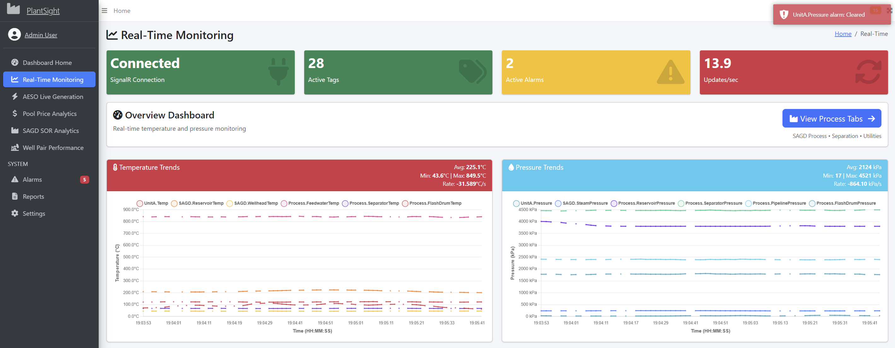
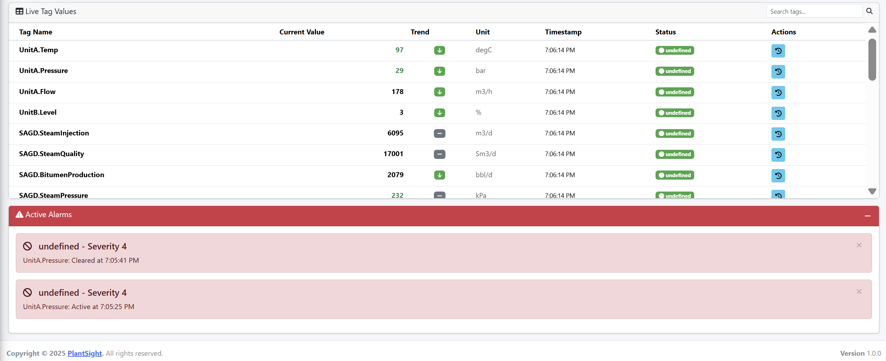
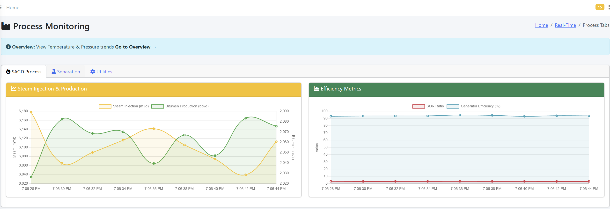
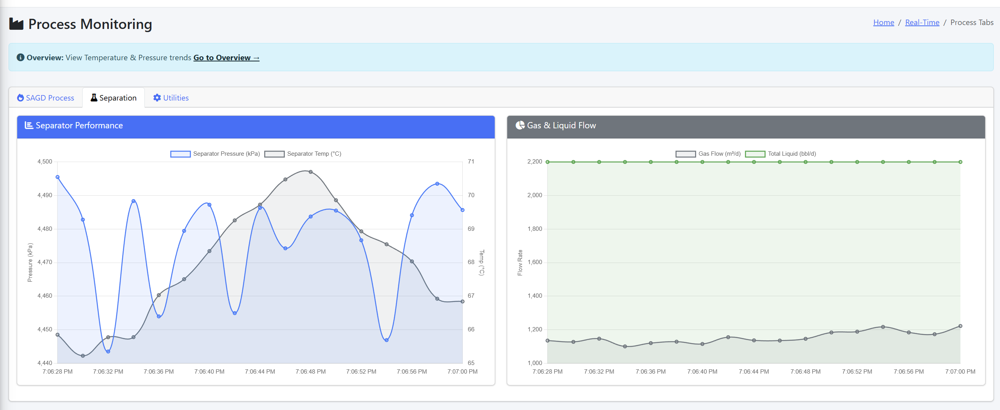
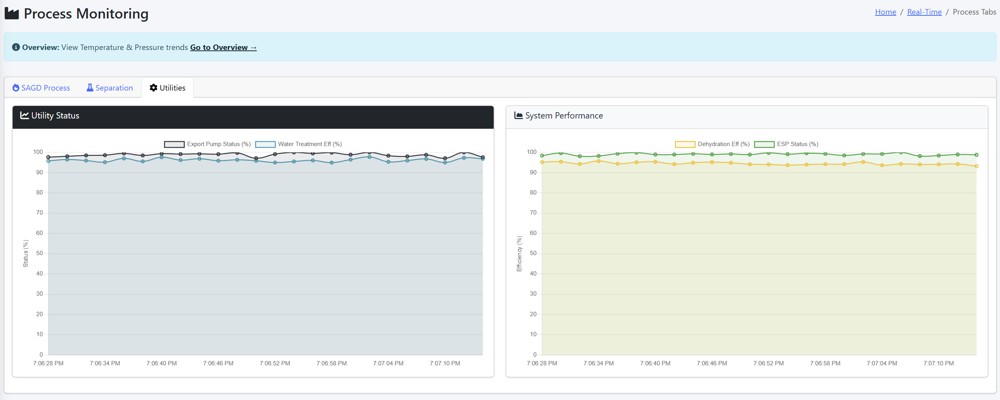

# PlantSight - Real-Time SCADA Dashboard

A professional real-time SCADA dashboard built with ASP.NET Core 9.0 and C# for monitoring SAGD (Steam-Assisted Gravity Drainage) operations. This project demonstrates live process monitoring with realistic data simulation, real-time calculations, and advanced visualization techniques.

## Tech Stack

- **ASP.NET Core 9.0** - Backend framework
- **SignalR** - Real-time bidirectional communication
- **Modbus TCP Simulator** - Realistic process data generation (no hardware required)
- **PostgreSQL/Supabase** - Data persistence
- **AdminLTE 3.2** - Professional dashboard UI
- **Chart.js** - Advanced real-time charting
- **Bootstrap 5** - Responsive UI framework

## Getting Started

```bash
dotnet restore
cd src/Dashboard.Web
dotnet run
```

Then open `http://localhost:8080/Dashboard/Realtime` in your browser.

---

## Real-Time Monitoring Dashboard

The Real-Time Dashboard is the core of this application, providing live monitoring of all critical SAGD process variables with sub-second updates and advanced analytics.


**Overview Tab** - Real-time temperature and pressure trends with multi-series support, live statistics, and 1-second interval updates. Each process variable is displayed as a separate series with color-coded visualization.


**SAGD Process Tab** - Live monitoring of steam injection rates, bitumen production, SOR ratios, and generator efficiency. All calculations update in real-time as new data arrives.


**Separation Tab** - Real-time separator performance metrics including pressure, temperature, gas flow, and liquid production rates with synchronized multi-series charts.


**Utilities Tab** - System-wide utility monitoring including export pump status, water treatment efficiency, dehydration efficiency, and ESP (Electric Submersible Pump) status.


**Live Tag Values Table** - Complete real-time tag browser with search functionality, trend indicators, color-coded status, and timestamp tracking for all process variables.

### Dashboard Architecture

The Real-Time Dashboard is split into two main pages for better organization:

1. **Overview Page** (`/Dashboard/Realtime`) - Temperature and pressure trends with comprehensive statistics
2. **Process Tabs Page** (`/Dashboard/ProcessTabs`) - SAGD Process, Separation, and Utilities monitoring

Both pages share the same SignalR connection and receive live updates simultaneously.

---

## Process Monitoring: SAGD, Separation & Utilities

### SAGD Process Monitoring

**Steam Injection & Production:**
- **Steam Injection Rate**: Monitored in m³/d, typically ranging 5,000-8,000 m³/d
- **Bitumen Production**: Tracked in bbl/d, typically 1,500-2,800 bbl/d
- **SOR Ratio**: Calculated as `Steam Injection (m³/d) ÷ Bitumen Production (bbl/d)`
- **Steam Quality**: Standard cubic meters per day (Sm³/d)
- **Reservoir Temperature**: Critical for optimal SAGD operations (175-250°C range)
- **ESP Status**: Electric Submersible Pump operational percentage
- **Wellhead Temperature**: Surface temperature monitoring (0-60°C)
- **Water Cut**: Percentage of water in produced fluids

**Efficiency Metrics:**
- **SOR Ratio**: Real-time Steam-to-Oil Ratio calculation
- **Steam Generator Efficiency**: Boiler efficiency percentage (typically 90-100%)
- **Reservoir Pressure**: Subsurface pressure monitoring (0-5,000 kPa)

### Separation Process

**Separator Performance:**
- **Separator Pressure**: Operating pressure (0-5,000 kPa)
- **Separator Temperature**: Operating temperature (0-100°C)
- **Produced Gas Flow**: Gas production rate (m³/d)
- **Total Liquid Production**: Combined liquid output (bbl/d)

**Dehydration & Treatment:**
- **Dehydration Efficiency**: Water removal efficiency percentage
- **Water Treatment Efficiency**: Processed water quality percentage

### Utilities

**System Performance:**
- **Export Pump Status**: Pipeline export pump operational percentage
- **Water Treatment Efficiency**: Overall water treatment system efficiency
- **Pipeline Pressure**: Export pipeline pressure (0-3,000 kPa)
- **Flash Drum Operations**: Flash drum pressure and temperature
- **Water Injection Rate**: Re-injection rate for reservoir management (m³/d)

---

## Research & Calculations

### Advanced Data Simulation

The backend simulator uses sophisticated mathematical models to generate realistic process data:

**Multi-Frequency Variation:**
- Uses 8 overlapping sine wave components with different frequencies (0.001 to 0.034 Hz)
- Creates non-repetitive, realistic process noise patterns
- Each component has random phase offsets for unique behavior

**Random Walk with Damping:**
- Implements Brownian motion-like drift with velocity damping (0.92-0.95)
- Simulates process inertia and gradual parameter changes
- Prevents unrealistic jumps while maintaining natural variation

**Gaussian Noise Generation:**
- Box-Muller transform for proper Gaussian distribution
- Configurable standard deviation per process variable
- Realistic sensor noise simulation

**Process Correlations:**
- Temperature affects pressure (thermal expansion)
- Steam injection correlates with bitumen production (with phase lag)
- Separator performance affects downstream utilities
- Realistic inter-variable dependencies

**PID-Like Control Simulation:**
- Process variables respond to setpoints with velocity-based control
- Simulates real control system behavior
- Maintains realistic operating ranges

### Frontend Calculations

**Moving Average Smoothing:**
- 5-point centered moving average for chart visualization
- Reduces noise while preserving trends
- Formula: `MA[i] = (values[i-2] + values[i-1] + values[i] + values[i+1] + values[i+2]) / 5`

**Real-Time Statistics:**
- **Average**: Running average of all values in the current window (60 seconds)
- **Min/Max**: Tracked across the entire data window
- **Rate of Change**: `Rate = (CurrentValue - PreviousValue) / TimeDifference (seconds)`
- Updates every second as new data arrives

**Time Synchronization:**
- All series synchronized to common time labels
- Handles missing data points with null values
- Ensures accurate multi-series comparison

**Trend Analysis:**
- 3-point trend calculation with 1% threshold
- Determines if values are increasing, decreasing, or stable
- Visual indicators (arrows) for quick status assessment

---

## Data Flow: Backend to Frontend

### 1. Data Simulation (Backend)

**ModbusSimulator.cs** generates realistic process data:

```csharp
// Every second, the simulator:
1. Calculates elapsed time since start
2. Generates multi-frequency variation for each variable
3. Applies random walk with damping
4. Adds Gaussian noise
5. Applies process correlations and control logic
6. Updates Modbus holding registers
```

**Key Simulation Features:**
- Updates every 1 second
- 25+ process variables simulated
- Realistic operating ranges based on industry standards
- Correlated variables (steam affects production, temperature affects pressure)

### 2. Data Acquisition (Backend)

**ModbusAcquisition.cs** polls the simulator:

```csharp
// Every 2 seconds:
1. Reads all configured tag registers
2. Applies scaling and offset transformations
3. Validates data quality
4. Broadcasts via SignalR hub
```

**Tag Configuration:**
- Each tag has: Name, Engineering Unit, Span (Low/High), Data Type, Register Address
- Scaling formula: `ScaledValue = (RawValue × Scale) + Offset`
- Quality codes: 192 = Good, 0 = Bad

### 3. SignalR Broadcasting (Backend)

**TelemetryHub.cs** distributes data:

```csharp
// On each update:
1. Creates TelemetryMessage with: TagName, Value, Unit, Timestamp, Quality
2. Broadcasts to all connected clients via SignalR
3. No polling required - push-based architecture
```

**Message Format:**
```json
{
  "tagName": "SAGD.SteamInjection",
  "value": 6542.3,
  "unit": "m3/d",
  "timestamp": "2025-01-15T10:23:45Z",
  "quality": 192,
  "source": "Modbus"
}
```

### 4. Frontend Reception (JavaScript)

**SignalR Connection:**
```javascript
connection.on("ReceiveTelemetry", (message) => {
    // Update tag table
    updateTagValue(message.tagName, message.value, message.unit, message.timestamp);
    // Update charts
    updateChart(message.tagName, message.value, message.timestamp);
});
```

**Chart Updates:**
- Each tag creates/updates its own dataset
- Time labels synchronized across all series
- Moving average applied for visualization
- Statistics recalculated in real-time
- Chart.js updates with `update('none')` for zero animation delay

### 5. Live Display

**Update Frequency:**
- Backend simulator: 1 second
- Data acquisition: 2 seconds (polls simulator)
- SignalR broadcast: ~2 seconds (when new data arrives)
- Frontend update: Instant (as messages arrive)
- Chart refresh: Real-time (no animation delay)

**Performance Optimizations:**
- Maximum 60 data points per series (1 minute of history at 1-second intervals)
- Efficient data structures (Maps for O(1) lookups)
- Chart.js configured with `animation: { duration: 0 }`
- Smart data trimming (removes oldest points when limit reached)

---

## Additional Dashboards

This project also includes two additional dashboards that were developed to explore more advanced SAGD concepts:

### SAGD SOR Analytics Dashboard

A dedicated dashboard for Steam-to-Oil Ratio analysis and optimization. This dashboard focuses on SOR efficiency calculations and trend analysis.

**Key Calculations:**
- **SOR Formula**: `SOR = Steam Injected (m³/d) ÷ Bitumen Produced (bbl/d)`
- **Steam Injection Simulation**: Base ~6,495 m³/d with sine wave variation (±300 amplitude) and random noise, bounded 5,000-8,000 m³/d
- **Bitumen Production Simulation**: Base ~2,150 bbl/d with inverse correlation to steam (phase-shifted sine wave) plus random trend and noise, bounded 1,500-2,800 bbl/d
- **Efficiency Tracking**: Monitors SOR trends over time to identify optimization opportunities

The simulator uses advanced mathematical models including multi-frequency sine waves, random walk trends, and Gaussian noise to simulate realistic sensor readings from SAGD wells, enabling full system testing without industrial hardware.

### Well Pair Performance Dashboard

Real-time monitoring of 66 well pairs across multiple facilities with comprehensive KPI tracking and anomaly detection.

**Key Calculations:**
- **Well Pair Distribution**: 66 well pairs across 2 facilities (Facility A: 31 pairs, Facility B: 35 pairs), 16 pads total (8 per facility)
- **Production Rate**: `base + sine(0.5 freq, ±30 amplitude) + random_walk(±30) + noise(±20)`, bounded 250-500 bbl/d
- **Subcool Temperature**: Base 187.0°C (optimal: 175-205°C), calculated as `187.0 + sine(0.3 freq, ±8°C) + noise(±3°C)`
- **Wellhead Pressure**: Base 9,000 kPa, calculated as `9000 + sine(0.4 freq, ±150 kPa) + noise(±100 kPa)`, bounded 8,000-10,500 kPa
- **Steam Injection Rates**: Base 1,180 Sm³/d per well pair, calculated as `1180 + sine(0.6 freq, ±80 Sm³/d) + noise(±50 Sm³/d)`
- **SOR Ratio**: `SOR = Steam Injection (Sm³/d) ÷ Production Rate (bbl/d)`
- **System Uptime**: Weighted average based on facility uptime percentages
- **Status Logic**: Alert (Red) for subcool <170°C or >210°C, pressure >10,500 kPa, production drop >20%, uptime <90%; Caution (Yellow) for marginal conditions; Normal (Green) for optimal operations

**Real-Time KPI Aggregation:**
- Total Bitumen Production: Sum of all production rates
- Total Steam Injection: Sum of all steam injection rates
- Average Subcool Temperature: Mean across all 66 well pairs
- Average SOR: Mean SOR ratio across all well pairs
- System Uptime: Weighted average based on facility uptime
- Active Well Pairs: Count of all operational well pairs

All data updates every second via SignalR for real-time visualization and analysis.

---

## Project Structure

```
src/
├── Dashboard.Web/          # Main web application (ASP.NET Core)
│   ├── Controllers/        # MVC controllers
│   ├── Views/              # Razor views (Realtime.cshtml, ProcessTabs.cshtml)
│   ├── Hubs/               # SignalR hubs (TelemetryHub)
│   └── Services/           # Frontend services
├── Dashboard.Domain/       # Business logic and models
│   ├── Models/             # Tag, AlarmRule, etc.
│   └── Services/           # AlarmEngine, AesoApiService
├── Dashboard.Simulator/    # Modbus TCP simulator
│   └── ModbusSimulator.cs  # Process data generation
├── Dashboard.Acquisition/  # Data acquisition service
│   └── Services/           # ModbusAcquisition
├── Dashboard.Persistence/ # Database layer
│   └── Entities/          # EF Core entities
└── Dashboard.Contracts/    # DTOs and interfaces
    └── DTOs/              # TelemetryMessage, AlarmMessage
```

## Configuration

Copy `appsettings.example.json` to `appsettings.json` and configure:
- Database connection string (PostgreSQL/Supabase)
- AESO API key (optional, for live power grid data)
- Modbus simulator settings

## Notes

This project demonstrates professional SCADA dashboard development with:
- **Real-time data visualization** with sub-second updates
- **Advanced mathematical modeling** for realistic process simulation
- **Modern web technologies** (ASP.NET Core, SignalR, Chart.js)
- **Industrial SCADA patterns** (tags, alarms, quality codes, scaling)
- **Professional UI/UX** with AdminLTE and responsive design

The Modbus simulator enables full system testing without real industrial hardware. All SAGD parameters (steam injection, bitumen production, reservoir temperature, ESP status, separator operations, utilities) are simulated using advanced mathematical models to provide realistic, non-repetitive data for the analytics dashboards.
